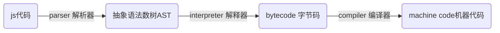
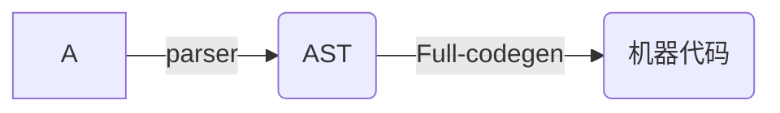

# javascript-basis

## V8编译过程

> - 主要由C++开发
> - 三个重要的组件: 解析器, 解释器, 编译器
> - 特点
>   1. 函数值声明未被调用, 不会被解析生成AST
>   2. 函数只被调用一次, bytecode直接被解释执行
>   3. 函数被调用多次, ==可能==会被标记为热点函数, 可以会被编译成机器代码
>   4. 当一个函数被定义好,不要重复调用传入不同类型的参数,会导致机械代码回退到字节码重新编译,会影响性能


### 编译过程

> 1. 词法分析(分词)
>    这个过程会将代码中的字符分解成对应有意义的代码块，这些代码块被称为词法单元（token）。
>
>    ```js
>     var a = 1;
>     => 'var' 'a' '=' '1' ';'
>    ```
>
>    - 至于空格会不会被当做词法单元（token），取决于空格在这门语言中是否有意义。
>
> 2. 语法分析(解析)
>    这个过程将词法单元流转换为一个元素逐级嵌套所组成的程序语法结构的数，被称为抽象语法树(AST);
>
> 3. 运行阶段
>    预解析 - JavaScript引擎将语法检查正常后生成的语法树复制到当前执行的上下文环境中。（包含了函数提升、变量提升等等）。
>    执行上下文 - 包含了变量对象、作用域链、this
>    变量对象：由变量申明、函数声明、参数构成。变量对象是单例实现的。
>    作用域链 - 变量对象和所有的父级作用域构成的。
>    this - 在进入上下文阶段就已经确定了 一旦进入执行代码阶段阶段，this值就不会发生过改变了。
>
> ## Babel


### 现在的V8



### 早期V8



## script标签

>   1. async 属性: 表示立即下载脚本，但不会影响页面的其他操作。[规定脚本将被异步执行], 只适合外部脚本, 下载完成后立即执行
>  2. charset 属性: 规定在外部脚本把文件中使用的编码不同。
>  3. defer 属性: 表示脚本可以延迟到文档被解析和显示之后再执行。只有对外部脚本有效。立即下载, 但是延迟执行
>  4. src 属性: 表示包含要执行代码的外部文件。
>  5. type 属性: 规定了脚本的MIME属性[内容属性]
>  6. language 属性: 已废弃。


## 变量

### 命名

#### 方法

> - 匈牙利命名法
>

| 类型               | 描述   | 匈牙利命名法 |
| ------------------ | ------ | ------------ |
| int                | 整形   | i            |
| float              | 浮点   | fl           |
| boolean            | 布尔   | b            |
| String             | 字符串 | s            |
| Array              | 数组   | a            |
| Object             | 对象   | o            |
| Function 函数 fn   | 函数   | fn           |
| Regular Expression | 正则   | re           |

#### 规则

> - 首字母: 英文字母或下划线
> - 组成: 英文、字母、下划线
> - 禁忌: JavaScript关键词 或 保留字

### 声明

> - 显示声明:var 变量名
> - 陋习: 没有类型, 重复声明, 隐式声明, 不声明直接赋值
> - 正解: 
>   - 先声明, 后读写
>   - 先赋值, 后运算

### 变量类型

#### 值类型

> 1. 占用空间固定,保存在栈中
> 2. 保存于复制的是值本身
> 3. 使用typeof检测数据的类型
> 4. ==基本数据类型数据是值类型==

#### 引用类型

> 1. 占用空间不固定, 保存在堆中
> 2. 保存于复制的是指向对象的一个指针
> 3. 使用instanceof检测数据类型
> 4. 使用new()方法构造出的对象是引用型

### 作用域

#### 全局变量

> - 包含: 
>   - 在函数体外定义的变量
>   - 在函数体内部定义的无var 的变量
> - 调用:任何地方

#### 局部变量

> - 包含: 
>   - 在函数内部使用var声明的变量
>   - 函数的参数变量
> - 调用: 当前函数体内部

#### 优先级

> - 局部变量	>	同名全局变量
> - 参数变量	>	同名的全局变量
> - 局部变量	>	同名参数变量

#### 特性

> - 忽略块级作用域
> - 全局变量是全局对象的属性
> - 局部变量是调用对象的属性
> - 作用域链: 
>   - 内部函数可以访问外层函数局部变量
>   - 外层函数不能访问内层函数局部变量
> - 生命周期: 
>   - 全局变量 : 除非被显示删除, 否则一直都在
>   - 局部变量 : 自声明起至函数运行完毕或被显示删除
>   - 回收机制:
>     - 标记清除
>     - 引用计数


## 运算符

### 算术运算符

#### 运算符

##### +

> - 功能: 
>   - 对数字进行代数求和
>   - 对字符串进行拼接
>   - 将一个数值转换成字符串(数值+空字符串)
>   - 字符串拼接: 
>     - 字符串+字符串 : 二者直接拼接
>     - 字符串+数值 : 数值转换为字符串再拼接-

##### -

> - 功能:  
>   - 对操作数进行取反
>   - 对数字进行减法操作
>   - ==将字符串转换成数值 ( 数值型字符串 - 0 )==

##### *  : 乘 	/ : 除法 	% : 取余   

#### 符合赋值运算符

> += , -=, *=,/=, %=

#### 自增自减 -- ++

> 符号放前就先算

#### 关系运算符

> < , > , < = ,> = , ===, ! ==
>
> - 字符串间比较=>比较他们的Unicode数值
> - 与NaN的比较,返回false

#### 对象运算符

> - in : 判断左侧运算数是否为右侧运算数的成员
> - instanceof : 判断对象实例是否输入某个类或构造函数
> - new : 根据构造函数创建一个新的对象, 并初始化该对象
> - delete : 删除指定对象的饿属性, 数组元素或变量
> - .及[] : 存取对象和数组元素
> - {} : 函数调用,改变运算符优先级等

#### 逻辑运算符

> !, &&, ||
>
> - 非 ! :
>   - 返回值:
>     - true: 空字符串, 0, null, NaN, undefined
>     - false: 对象, 非空字符串 , 非0数字(Infinity)
>   - 特性: 
>     - 连续使用两次,可以将任何类型转换成布尔类型
> - 与 && : 
>   - 规则:
>     - 第一个操作数是对象 返回第二个操作数
>     - 第二个操作数是对象 第一个操作数值为true时返回该对象
>     - 两个操作数都是对象 返回第二个操作数
>     - 一个操作数是null 返回null
>     - 一个操作数是NaN 返回NaN
>     - 一个操作数是undefined 返回undefined
>   - 特性: 
>     - 当且仅当两个运算数的值都是true时,才返回true,否则都是false
>     - 短路操作  当第一个操作数是false则不在对第二个操作数进行求值
> - 或 || :
>   - 规则:
>     - 第一个操作数是对象	 返回第一个操作数
>     - 第一个操作数值为false 返回第二操作数
>     - 两个操作数都是对象 返回第一个操作数
>     - 两个操作数都是null 返回null
>     - 两个操作数都是NaN 返回NaN
>     - 两个操作数都是undefined 返回undefined
>   - 特性:
>     - 当且仅当两个运算数值都是false时, 才返回false , 否则返回true
>     - 如果第一个操作数值为true, 则不会对第二个操作数进行求值

#### 位运算符

> javaScript位运算不比普通运算有效率提升

##### 基础知识

> - 类型: 
>   - 有符号 : 一位符号 +  31位数值位
>   - 无符号:
>     - 只能是正数
>     - 32位数值位(0正 1负)
>     - 数值范围可以加大
> - 数值范围: -$2^{31}$ ~ $2^{31}$-1
> - 存储方式:
>   - 正数
>     - 纯二进制存储
>     - 31位中每一位表示2的幂
>     - 用0补充无用位
>   - 负数
>     - 二进制补码存储
>
> - NaN和Infinity做0存储

##### 逻辑位运算

> ~, &, |, ^(异或)

##### 位移

> - $<<$左移: 数值位左移$x$位置(除以$2^{x}$)
>
> - $>>$有符号右移:数值位右移$x$位置(乘以$2^{x}$)
> - $>>>$无符号右移:
>   - 正数: 和$>>$相同
>   - 负数: 会出现无限大的数值
> - 复合赋值运算符: 位操作符与等号结合, 复合赋值不会有性能提升

其他运算符

> ?:	三目运算符
>
> typeof:类型判定运算符
>
> void 舍弃运算符的值,返回undefined作为表达式值

## 数据类型

### undefined

> - 使用var声明变量但未初始化
> - 区分空对象指针与尚未定义的变量
> - 对未初始化的变量以及未声明的变量使用
> - typeof运算符均会返回undefined
> - 与null的关系
>   - undefine派生于null, 所以  "==" 比较会返回true

### null

> - 逻辑上null表示一个空对象的指针
> - 使用typeof检测时会返回object

### boolean

> - true不一定为1, false不一定为0
> - 使用Boolean()进行转换
>   - 转换为true
>     - 任何非空字符串
>     - 任何非零数值
>     - 任何非空对象
>   - 转换为false
>     - 空字符串
>     - 0, NaN
>     - null及undefined

### string

### number

#### 进制

> - 十进制
> - 八进制
>   - 前导 0
>   - 有效数列 0 - 8
>   - 超出范围: 
>     - 前倒位0倍倍忽略
>     - 后续数值以十进制计数 
> - 十六进制
>   - 前导 0x
>   - 有效数列: 0-9, A-F

浮点数

> - 小数点后至少一位数
> - 科学计数法
>   - 小数点后带有6个0的浮点数
>   - 以e为底${^{*}10}$的正负次幂
> - 最高精度 17位小数
> - 缺陷
>   - 存在舍入误差
>   - 无法测试特点浮点数值
> - 数值范围
>   - 最小值 Number.MIN_VALUE
>   - 最大值 Number.MAX_VALUE
> - 超出范围
>   - 正无穷 
>     - Infinity
>     - Number.POSITIVE_INFINITY
>   - 负无穷
>     - -Infinity
>     - Number.NEGATIVE_INFINITY
>   - 缺陷
>     - 无法参与下一次计算
>   - 检测方法
>     - isFinite()
>       - 超出范围 false
>       - 合法范围 true

#### NaN

> - 含义: Not a Number
> - 特点:
>   - 任何涉及NaN的操作都将返回NaN
>   - NaN与任何数值都不相等包括及其自身
> - 检测:
>   - isNaN()
>     - 可以转换为数值 false
>     - 不能转换为数值 true

#### 数值转换

> - Number()
>   - Boolean 
>     - true => 1
>     - false => 0
>   - null => 0
>   - undefined => NaN
>   - String
>     - 只包含数字( 十进制数, 前导0被忽略)
>     - 包含有效浮点格式 ( 浮点数值, 忽略前导0 )
>     - 包含有效16进制格式 相同大小的十进制整数
>     - 空字符串 => 0
>     - 其他字符串 => NaN
>   - object 
>     - valueOf()
>     - toString()
> - parseInt()
>   - 特性
>     - 忽略前置空格
>     - 直接找到第一个非空字符
>       - 不是数字或负号 NaN
>       - 数字字符
>         - 解析所有后续字符
>         - 遇到非数字字符结束
>     - 小数点不是有效数字
>   - 参数
>     - 参数1: 要解析的字符串
>     - 参数2: 转换时所使用的基数
> - parseFloat()
>   - 从第一个字符开始解析, 遇到无效浮点格式后结束
>   - 只有第一个小数点有效
>   - 忽略前导0
>   - 16进制始终为0
>   - 没有小数点或小数点后全0, 转换为整数

### object

> - 一个数组或功能的集合
> - var o = new Object();
> - 属性与方法
>   - Constructor : 保存用于创建当前对象的函数
>   - hasOwnProperty(propertyName) : 检测给定属性在当前对象实例中是否存在
>   - isPrototypeOf(object) : 检测传入的对象是否是另一个对象的原型
>   - propertyIsEnumerable(propertyName) : 检测给定属性是否能for-in语句枚举
>   - toLocaleString() : 返回的字符串表示, 该字符串与执行环境的地区对应
>   - toString() :  返回对象的字符串表示
>   - valueOf() : 返回对象的字符串, 数值或布尔值表示; 通常toString()的值相同

## 数组

### 创建方法

> 空数组:	var Obj  = new Array();
>
> 指定长度数组: var Obj  =  new Array(size);
>
> 指定元素数组: var Obj = new Array(元素1, 元素2, 元素3....);
>
> 单维数组: var Obj = [元素1, 元素2, 元素3....];
>
> 多维数组: var Obj = [[数组序列1],[数组序列2],[数组序列3]...]

### 基本操作

- 特性: 
  - 下标类型:
    - 数值
    - 非数值
      - 转换为字符串
      - 生成关联数组,  下标将作为对象属性的名字

- 删除数组 delete 数组名[下标]

- 遍历数组 for(var 数组元素变量 in 数组)

### 数组属性

> - constructor:
>   - 引用数组对象的构造函数
> - length :
>   - 返回数组的长度
> - prototype
>   - 通过增加属性和方法扩展数组定义

### 数组方法

#### ECMAScript3

##### 添加

> push() 尾加
>
> unshify()头加
>
> concat() 合并两个数组

##### 删除

> pop() 尾删
>
> shift() 头删

##### 子数组

> - splice()
>   - 删除任意数量: `splice( [删除的其实坐标], [要删除的项] )`
>   - 在指定位置插入指定的项目: `splice([起始坐标], 0 ,[插入的项])`
>   - 替换任意数量的项: `splice([起始坐标], [要删除的数量], [要插入的项目])`
> - slice()
>   - 功能: 从已有数组中选取部分元素构成新的数组
>   - 用法: `slice([起始位置], [结束位置])`
>   - 特性: 
>     - 如果位置为负数, 则用数组长度加上改值确认位置
>     - 起始位置为数组实际下标
>     - 结束位置为实际下标减一

##### 数组排序

> - reverse():  颠倒数组中的元素顺序
> - sort(): 排序
>   - 按照数值大小排序需要函数支持

##### 数组转换

> toString() 
>
> toLocaleString() :转换为本地格式字符串并返回
>
> join() 用指定分隔符连接数组并转换成字符串

#### ECMAScript5

##### 位置方法

> indexOf 起始位置开始查找
>
> lastIndexOf 结束位置开始查找

##### 迭代方法

- every : 每一项都返回true,则返回true

- filter : 返回值为true的所有数组

  ```js
  1. filter(callback, _this),有两个参数，第一个是必须有的回调函数，第二个是可以选择的回调函数执行中的this值
    
  2. callback(element, index, array),回调函数有三个参数，第一个参数是必须有的，是指当前元素的值。第二个参数是指当前元素的索引值，可选。第三个参数是指被遍历的数组本身，可选。
  
  过滤掉数组中大于3的元素
  [1, 2, 3, 4].filter(item=>item<3);
  ```

  

- forEach : 就是遍历,无返回值(undefined)

  ```reStructuredText
  Array.prototype.forEach();
  1. forEach(callback, [ _this ]) 遍历方法中有两个参数，一个是必须的会有的回调函数，第二个是可选择的回调函数执行的this值
  
  2. callback()回调函数的参数
      
    callback(value){},当回调函数的参数只有一个的时候，这个参数的就是每个元素的值
    callback(value, index){},当回调函数的参数有两个的时候，value 是每个元素的值，index 就是每个元素的索引
    callback(value, index, array){}, 当回调函数的有三个的时候，value 是每个元素的值，index 就是每个元素的索引，array 指的是当前数组
  ```

  

- map : **返回每次函数调用的结果数组**

  ```
    1. map(callback, [_this]) 遍历中有两个参数，一个是必须有的回调函数，第二个是可选择的回调函数执行的this值。
  
    2. callback()回调函数的参数
    	callback(value){},当回调函数的参数只有一个的时候，这个参数的就是每个元素的值
    	callback(value, index){},当回调函数的参数有两个的时候，value 是每个元素的值index 就是每个元素的索引。
    	callback(value, index, array){}, 当回调函数的有三个的时候，value 是每个元素的值，index 就是每个元素的索引，array 指的是当前数组。
  ```

  

- some : 有一项返回true,则返回true

  ```js
  1. some(callback, _this_)，有三个参数，
    数组，可选。
    _this_是指回调函数执行中的this值。
    
  2. callback(element, index, array)
    第一个参数是指，正在处理的元素。
    第二参数是指，当前当前元素的索引值，可选。
    第三个参数是指，调用some()的数组。
    
    [1,2,3,4].some(x => x>10);//false
  ```

  

##### 缩小方法

- 一般用作累加器

- reduce : 起始位置开始遍历

  ```
   1. reduce(callback, init); 有两个参数，第一个参数是必须有的回调函数，第二个是遍历之前的初始值。
  
   2. callback(acc, cur, [index], [arr]); 有四个参数，acc是指累加器，cur是指当前的元素值，index 是指当前元素的索引值，arr 是指当前的遍历的数组
  ```

  - 累加

    ```js
    var arr = [1,2,3,4,5]
    arr.reduce(function(acc, cur){
        return acc + cur;
    },0)
    
    // 返值为 15
    ```

    

  - 去重

    ```js
    var arr = [];
    arr.reduce(function(acc, cur){
        acc.indexOf(cur) === -1 && acc.push(cur);
        return acc;
    },[])
    ```

    

- reduceRight : 尾部开始遍历

  - 接收参数
    - 每一项上调用的函数
    - 作为缩小基础的初始值
  - 传入参数
    - 前一个值prev
    - 当前值cur
    - 项的索引index
    - 数组对象array

## 流程控制

### 循环语句

> `while([条件表达式]){}`
>
> `do-while([条件表达式])`:至少执行一次
>
> `for(;循环条件;){}`
>
> `for(声明变量 in 对象){} `: 枚举对象属性(对象不可以为null,undefined)

### 跳转语句

> return 
>
> break
>
> continue

### 选择语句

> ```js
> if([条件表达式]){
> 	...
> }else if[条件表达式]){
> ...
> }else{
> ...
> }
> ```
>
> ```js
> switch([条件表达式]){
> case 标签1:
>  代码片段1;
>  break;
>  ...
>  default: 
>  代码片段n;
> }
> ```

### 异常处理语句

> throw: 主动抛出异常
>
> try: 指明需要处理的代码段
>
> catch: 捕获异常
>
> finally: 后期处理

## 字符串函数

### 查找方法

#### 字符方法

> - charAt([要查询下标])				根据下标查找指定字符,超出范围返回空字符串
>
> - charCodeAt([要查询下标])     返回Unicode编码		超出范围返回NaN
>
> - fromCharCode()			             根据字符编码创建字符串

#### 位置方法

> - 根据指定字符串查找下标
>   - 没有找到返回 -1
>   - indexOf()    : 首次出现的下标
>   - lastIndexOf() : 最后一次出现的下标

#### 匹配方法

> - match()
>
>   - 找到一个或多个正则表达式的匹配
>   - 参数: 
>     - 要进行模式匹配的正则表达式
>     - 非正则表达式 将其传递给RegExp()构造函数,并转换为正则表达式对象
>   - 返回值
>     - 存放匹配结果的数组
>     - 有全局标记g
>     - 无全局标记g(执行一次匹配)
>
> - search()
>
>   - 功能: 检索字符串分钟与正则雕大师匹配的字串
>   - 参数: 要进行模式匹配的正则表达式
>   - 返回值:
>     - 找到: 第一个个匹配的起始位置
>     - 未找到: -1
>   - 特性: 忽略全局标记g和lastIndex()属性
>
> - replace()
>
>   - 替换一个与正则表达式匹配的字串
>
>   - 参数
>
>     - 参数1: 需要进行替换正则表达式或字符串
>     - 参数2: 替换文本或替换函数
>
>   - 特性:
>
>     - 要想全局替换要加全局标记g
>
>     - 如果参数2位字符串这可使用特殊字符序列
>
>     - ```js
>       $$ 	$
>       $&	匹配整个模式的子字符串
>       $'	匹配子字符串之前的子字符串
>       $`	匹配子字符串之后的子字符串
>       $n	 匹配第n个捕获组的子字符串 n=1~9
>       $nn	匹配第nn个捕获组的子字符串 nn=1~~99
>       ```
>
> - split():切割
>
>   - 必须: 指定分隔符
>   - 可选: 指定数组的长度

### 操作方法

#### 拼接方法

> - concat()和"+"功能相同
> - string.concat()
>   - 可以连接一个或多个值

#### 截取方法

> - 根据下标截取字符串
>   - slice()
>   - substring()
> - 根据长度截取字符串
>   - substr()

#### 空格处理

> - trim()	清除前后的空格
>
> - trimLeft()	清除前置空格
>
> - trimRight()	清除后缀空格

#### 填充处理

> - padStart: 长度不够在前面填充
>
> - padEnd: 长度不够就在后面填充
>
>   ```javascript
>     'x'.padstart(5, 'ab'); //ababx
>     'x'.padstart(4, 'ab'); //abax
>     'x'.padEnd(5, 'ab'); //xabab
>     'x'.padEnd(4, 'ab'); //xaba
>   ```

#### 比较方法

> localeCompare()
>
> - 用本地特定顺序比较两个字符串

### 编码方法

> - 字符串常规编码与解码
>   - escape()
>   - unescape()
> - URI字符串编码与解码
>   - encodeURI()
>   - decodeURI()
> - URI组件编码与解码
>   - encodeURIComponent()
>   - decodeURIComponent()

### 转换方法

> - 大小写转换: 
>   - 转为大写
>     - toUpperCase()
>     - toLocaleUpperCase()
>   - 转为小写
>     - toLowerCase()
>     - toLocaleLowerCase()

## 函数

### 定义方法

> 静态方法	function 函数名([参数]){}
>
> 动态匿名	var 函数名 = new Function(["虚参列表"], "函数体");
>
> 直接变量 函数名 = function([虚参列表]){函数体;}

### 调用方法

> - 直接调用 :	函数名(实参列表)
> - 在连接中调用: `<a href = "javascript: 函数名()">tap</a>`
> - 在事件中调用 : 事件类型 = "函数名()"
> - 递归调用

### 方法

> - apply  : 
>   - 将函数作为对象的方法来调用
>   - 将参数以数组形式传递给改方法(多个参)
>
> - call : 
>   - 将函数作为对象的方法来调用
>   - 将指定参数传递给该方法(一个参)
>
> - toString

### arguments对象

> - 功能: 存放实参的参数列表
> - 特性: 
>   - 仅能在函数体内使用
>   - 带有下标属性, 当并非数组
>   - 函数声明自动初始化
> - 属性: 
>   - length
>   - callee   当前正指向的函数
>   - caler    抵用当前正在执行函数的函数名

### 指针标识

> - this                 指向当前操作对象
> - callee             指向参数集合所处函数
> - prototype      指向函数附带的原型对象
> - constructor   指向创建该对象的构造函数


## DOM事件

### 事件级别

> DOM0: element.onclick = function(){}
>
> DOM2: element.addEventListener('click', function(){}, false)
>
> DOM3: element.addEventListener('keyup', function(){}, false)
>
> 没有DOM1, 因为DOM1标准制定的时候没有涉及DOM事件
>
> DOM3比DOM2添加了一些事件类型


### DOM事件捕获的具体流程

> 捕获流程:  window -> document -> html -> body- >...-> 目标元素
>
> 冒泡流程: 目标元素 -> ...-> body -> html - > document -> window


## DOM操作

### EventListener()方法

> - 添加事件监听器
>   - 语法 : `element.addEventListener( *event, function, useCapture* );`
>     - 参数1: 事件类型(不要使用"on"前缀, 例如"click", 而不是"onclick")
>     - 参数2: 时间出发调用函数
>     - 参数3: 是个布尔值(false: 冒泡, true:捕获[ 可选])
>   - eg: `document.getElementById("btn").addEventListener("click",myFunction);`
> - 移除事件监听器
>   - eg:`element*.removeEventLister("mousemove", myFunction);`

### 获取节点

> - document
>   - getElementById([元素ID])
>   - getElementByName([元素name属性])
>   - getElementsByTagName([元素标签])
> - 节点指针
>   - 父节点.firstChild : 获取元素的首个节点
>   - 父节点.lastChild : 获取元素最后一个节点
>   - 父节点.childNodes : 获取元素的==子节点列表==
>   - 兄弟节点.previousSibling : 获取已知节点的前一个节点
>   - 兄弟节点.nextSibling : 获取已知节点后一个节点
>   - 子节点.parentNode : 获取已知节点的父节点

### 节点操作

> - 创建节点 : 
>   - createElement
>     - document.createElement
>     - 创建元素节点
>   - createAttibute
>     - document.createAttibute
>     - 创建属性节点
>   - createTextNode
>     - document.createTextNode
>     - 创建文本节点
> - 插入节点
>   - appendChild
>     - appendChild(所添加的新节点)
>     - 向节点的子节点列表的末尾添加新的节点
>   - insertBefore
>     - insertBefore(所添加的新节点[已知子节点])
>     - 在已知节点前插入一个新的节点
> - 替换节点
>   - replaceChild
>     - replaceChild(要插入的新元素, 将被替换的老元素)
>     - 将某个子节点替换成另一个
> - 复制节点
>   - cloneNode
>     - 需要被赋值的节点.cloneNode(true/false)
>     - 创建指定节点的副本
>     - true : 复制当前节点以及所有的子节点
>     - false : 仅复制当前节点
> - 删除节点 : 
>   - removeChild(要删除的节点)
>   - 删除指定的节点
>     - 删除父节点的一个子节点 : document.getElementById("id1").parentNode.removeNode(document.getElementById("id2"))

### 属性操作

> - 获取属性: getAttribute([元素属性名])
>   - 元素节点.getAttribute(元素属性名)
>   - 获取元素节点指定的属性值
> - 设置属性: setAttribute([属性名], [属性值])
>   - 元素节点.setAttribute(属性名, 属性值)
>   - 创建或改变元素节点的属性
> - 删除属性: removeAttribute([属性名])
>   - 元素节点.removeAttribute(属性名)
>   - 删除元素中的指定属性

### 文本操作

> - insertData(offset, String)   :    从offset指定位置插入string
>
> - appedData(String)   :   将string插入到文本节点末尾处
>
> - deleteData(offset, count)  :    从offset起杀出count个字符
> - replaceData(off, count, string)    :    从off将count个字符用string替代
> - splitData(offset)   :   从offset起将文本节点分成两个节点
> - substring(offset, count)    :   返回有offset 起的count个节点


## Event对象

### event对象常见方法

> 1. event.preventDefault(): 取消事件的默认动作
> 2. event.stopoPropagation(): 阻止事件冒泡
> 3. event.stopImmediatePropagation(): 
>    1. 阻止剩下的事件处理程序被执行,	
>    2. 如果一个元素绑定了三个事件, 其中有一个调用了该方法, 其他两个事件将不会被执行


## 对象

### 对象方法

#### 创建对象的方法

```js
//1.字面量
var obj1 = {name: 'solo obj1'};
obj1// { name: "solo obj1" }

//2.new Object
var obj2 = new Object({name: 'solo obj2'})
obj2// { name: "solo obj2" }

//3.构造函数创建
var M = function(name){
  this.name = name;
}
var obj3 = new M('solo obj3');
obj3// { name: "solo obj3" }
M.prototype.constructor === M // true
M.prototype === obj3.__proto__ // true
//4.Object.create
var p = {name: 'p'};
var obj4 = Object.create(p);
obj4// {}
obj4.name // "p"
```


#### Object.is()

- 在 Es5 中，比较两个数是否相等，使用的是相等( == )和全等( === ),对两数进行比较。相等会自动转换数据类型(例如，布尔型数据类型在进行比较时，会转换为0或者1，NaN不等于NaN,)。

```js
Object.is(NaN,NaN); //true
Object.is(+0,-0);  //false
```

#### Object.assign(obj1,obj2,obj3,..)

- assign() 方法用于对象的合并
- obj1 属于目标对象，后面的obj对象均为源对象。

```js
var obj = {name:"zhangsan"}
var obj2 = {age:"19"}

Object.assign(obj,obj2); // {name:"zhangsan",age:"19"}
```

- 当目标对象和源对象的属性名称出现冲突时，后面对象的属性会覆盖前面的对象的属性。

```js
var obj = {name:"zhangsan"}
var obj2 = {name:"lisi"}
Object.assign(obj,obj2) // {name: "lisi"}
```

1. 当assign()方法中，只有一个参数，object.assign()方法会返回参数对象。
2. 当assign()方法中的参数不是对象，会先转换为对象，再返回该参数。
3. 当assign()方法中，第一个参数为null、undefined时，因为不能转换为对象，便会报错。（只要null，undefined不是首个参数，就不会报错）

*首个参数处理规则与其他的参数不同，除了首参，不能转换为对象的参数就会跳过。参数为数值、布尔型均会跳过。*


#### Object.assign() -- 深拷贝、浅拷贝

例子1：

```js
var obj = {name:"zhangsan"}
var obj2 = Object.assign({},obj);

console.log(obj) // {name:"zhangsan"}
console.log(obj2) // {name:"zhangsan"}

obj2.name = "lisi"; // {name:"lisi"}
console.log(obj2.name) // "lisi"
console.log(obj.name) // "zhangsan"
```

例子2：

```js
var obj = {name:"zhangsan",info:{age:"18"}}
var obj2 = Object.assign({},obj);

console.log(obj); // {name:"zhangsan",info:{age:"18"}}
console.log(obj2); // {name:"zhangsan",info:{age:"18"}}

obj2.info.age = "19"

console.log(obj2.info.age); // "19"
console.log(obj.info.age); // "19"
```

- 有以上两个例子得出。
  - Object.assign()的第一层属性是属于深拷贝，第二层以上的属性则为浅拷贝。
  - 第二层的会改变原数据

## Window对象 BOM

> 浏览器对象模型:BOM(Browser Object Model )

### Window尺寸&获取元素的相对位置

> Internet Explorer、Chrome、Firefox、Opera 以及 Safari：
>
> - window.innerHeight - 浏览器窗口的内部高度
> - window.innerWidth - 浏览器窗口的内部宽度
>
> Internet Explorer 8、7、6、5：
>
> - document.documentElement.clientHeight
> - document.documentElement.clientWidth
>
> 或者
>
> - document.body.clientHeight
> - document.body.clientWidth

| js代码                                              | 描述                                                         |
| --------------------------------------------------- | ------------------------------------------------------------ |
| element.clientWidth / clientHeight                  | 内高度 / 宽度: margin + content                              |
| element.offsetWidth / offsetHeight                  | 外高度 / 宽度:border + padding + content                     |
| element.clientTop / clientLeft                      | 上/左 边框                                                   |
| element.getBoundingClientRect()                     | x \ y:              元素的左上角和父元素左上角的距离 <br>width / height: 边框 + 内边距 + 内容框 <br/>top:                元素的上边界和父元素上边界的距离 <br/>left:                元素的左边界和父元素左边界的距离 <br/>right:              元素的右边界和父元素的左边界的距离 <br/>bottom:          元素的下边界和父元素上边界的距离 |
| element.offsetTop / element.offsetLeft              | 上边 / 左边 的偏移量                                         |
| document.documentElement.clientWidth / clientHeight | 可视区域的大小                                               |
| document.documentElement.scrollWidth / scrollHeight | 页面的实际大小                                               |
| window.screenX / screenY                            | 窗口左上角与屏幕左上角的距离                                 |
| window.screen.width / height                        | 屏幕可用宽高( 去除任务栏 )                                   |
| window.innerWidth / innerHeight                     | 窗口的内高度 / 宽度                                          |
| window.outerWidth / outerHeight                     | 窗口的外高度 / 宽度                                          |
|                                                     |                                                              |


### Window对象

#### 属性

> - 状态栏
>   - defaultStatus 改变浏览器状态栏的默认显示
>   - status          临时改变浏览器状态栏的显示
> - 窗口位置
>   - IE
>     - screenLeft  声明窗口的左上角的X坐标
>     - screenTop   声明窗口的左上角的Y坐标
>     - 声明当前文档向右滚动的像素数
>       - document.body.scrollLeft
>       - document.documentElement.scrollLeft
>     - 声明当前文档向下滚动过的像素数
>       - document.body.scrollTop
>       - document.documentElemnet.scrollTop
>   - !IE
>     - screeenX  声明窗口左上角的==X==坐标
>     - screenY     声明窗口左上角的==Y==坐标
>     - pageXOffset    声明当前文档向右滚动过的像素数
>     - pageYOffset     声明当前文档向下滚动过的像素数
>   - FF
>     - innerHeight    返回窗口的文档显示区的高度
>     - innerWidth      返回当前的文档显示区的宽度
>     - outerHeight     返回窗口的外部高度
>     - outerWidth       返回窗口的外部宽度
> - 其他属性

#### navigator(导航器对象)

>  - appCodeName   返回浏览器的代码名
>  - appName      返回浏览器的名称
>  - appVersion    返回浏览器的平台和版本信息
>  - cookieEnabled   返回指明浏览器中是否启动cookie的布尔值
>  - platform    返回浏览器的操作系统平台
>  - userAgent   返回客户机发送服务器的user-agent头部的值

#### screen(显示器对象)

>  - avaiHeight    返回显示器的可用高度
>  - avaiWidth     返回显示屏幕的可用宽度
>  - height      返回屏幕高度的像素数
>  - width       返回屏幕宽度的像素数
>  - colorDepth   返回屏幕颜色的位数

#### history(历史对象)

>- back()     返回前一个URL
>- forward()   返回下一个URL
>- go()     返回某个具体页面
>- 添加和修改历史记录中的条目
>
>  - pushState()  添加
>  - replaceState()  修改
>  - popstate

```js
//history向后跳转
window.history.back()    =>   window.history.go(-1)
window.history.forward();  =>  window.history.go(1)
let numberOfEntries = window.history.length//获取堆栈中页面的数量
let stateObj = {
	foo: 'bar'
}
history.pushState( stateObj, "page 2", "bar.html");
history.replaceState(stateObj, "page 3", "bar2.html");

window.onpopstate = function(event) {
  console.log("location: " + document.location + ", state: " + JSON.stringify(event.state));
};
//绑定事件处理函数. 
history.pushState({page: 1}, "title 1", "?page=1");    //添加并激活一个历史记录条目 http://example.com/example.html?page=1,条目索引为1
history.pushState({page: 2}, "title 2", "?page=2");    //添加并激活一个历史记录条目 http://example.com/example.html?page=2,条目索引为2
history.replaceState({page: 3}, "title 3", "?page=3"); 	//修改当前激活的历史记录条目 http://ex..?page=2 变为 http://ex..?page=3,条目索引为3
history.back(); 																	// 弹出 "location: http://example.com/example.html?page=1, state: {"page":1}"
history.back(); 																	// 弹出 "location: http://example.com/example.html, state: null
history.go(2);  																	// 弹出 "location: http://example.com/example.html?page=3, state: {"page":3}
```


#### location(位置对象)

>  - 属性
>    - hash    设置或返回从#号开始的URL
>    - host     设置或返回主机名或当前URL的端口号
>    - hostname   设置或返回当前URL的主机名
>    - href     设置或返回完整的URL
>    - pathname    设置或返回当前URL的路径部分
>    - port    设置或返回当前URL的端口号
>    - protocol    设置或返回当前URL的端口号
>    - search    设置或返回?开始的URL
>  - 方法
>    - assign(URL)    加载新的文档
>    - reload()      重现加载当前页面
>    - replace(newURl)    用新的完蛋替换当前文档

#### document(文档对象)

##### 集合

> - anchors[]  锚点对象数组
> - images[]    图片对象数组
> - links[]        连接对象数组
> - forms[]      表单对象数组

##### 属性

> - cookie  设置或返回与当前文档有关所有cookie
> - domain   返回当前文档的域名
> - referrer   返回载入当前文档的文档的URL
> - title 返回当前文档的标题
> - URL 返回当前文档的URL

##### 方法

> - open()   打开一个新的文档, 并查处旧文档内容
> - close()   关闭文档输出流
> - write()    向当前文档追加写入文本
> - writeIn()   与wtite()相同,在<pre>中追加换行


#### 窗口控制

>- moveBy:
> - moveBy(水平位移量, 垂直位移量) 
> - 按照指定像素移动指定窗口
>- moveTo:
> - moveTo(x, y)
> - 将窗口移动到指定坐标(x, y)
>- resizeBy:
> - resizeBy(x, y)
> - 将当前窗口改变指定的大小(x, y)
> - 当x, y 的值大于0时为扩大
> - 当x, y 的值小于0时为缩小
>- resizeTo
> - resizeTo(x, y)
> - 将当前窗口改编成(x, y)大小, x, y分别为宽度和高度
>- scrollBy
> - scrollBy(x, y)
> - 将窗口中的内容给定的唯一量滚动
> - 参数为正数, 正向滚动, 反之, 反向
>- scrollTo
> - scrollTo(x, y)
> - 将窗口内容滚动到指定位置

#### 焦点控制

> - focus 得到焦点
> - blur    移出焦点

#### 打开关闭窗口

>- open
> - open("URL", "窗口名称", "窗口风格")
> - 打开一个新的窗口, 并在窗口中转载指定URL地址的网页
> - 窗口风格:
>   - height    数值    窗口高度   不能小于100
>   - width      数值    窗口宽度    不能小于100
>   - left    数值    窗口左坐标   不能为负值
>   - top    数值    窗口上坐标   不能为负值
>   - location     是否显示地址栏
>   - menubar     是否显示菜单栏
>   - resizable      是否可以改变窗口大小
>   - scrollbars   是否允许出现滚动栏
>   - status    是否显示状态栏
>   - toolbar   是否显示工具栏
>- close
> - close()
> - 自动关闭浏览器窗口

#### 定时器

>- setTimeout(将执行代码,  毫秒):定时器
> - 到了指定时间后执行代码
>- clearTimeout(定时器)
> - 取消由setTimeout设置的定时器
>- setInterval(重复执行的代码, 毫秒):时间间隔器
> - 指定周期重复执行功能代码
>- clearInterval(时间间隔器)
> - 取消由setInterval()设置的时间间隔期

#### 对话框

> - alert("提示字符串")
> - confirm("提示字符串")
>   - 确认=>返回true, 反之false
> - prompt("提示字符串", "缺省文本")
>   - 返回输入的字符串
>   - 点击取消   返回null


## 事件队列

> 1. js的执行是单线程的。
>
> 2. 而当它遇到了window的setTimeout和setInterval这样的异步任务，js都默默地先不执行这些回调，而是继续向下执行其他js脚本，等到所有js脚本都解析执行完了，再执行回调。
>
> 
>
> 3. 那么有多个回调的时候执行顺序是怎么样的呢？
>
> 浏览器是多线程的，js执行线程只是它多个线程中的一个。
>
> 当js的执行线程看到了setTimeout，浏览器马上会调用**其他线程**把这个函数中的回调扔到浏览器的事件队列中，事件队列是先入先出的队列。
>
> 那么在js执行线程执行完所有脚本空闲的时候，事件队列中的事件回调，会一个一个被拿出来执行。
>
> 浏览器有一个内部大消息循环Event Loop（事件循环），会轮询事件队列并处理事件。


## 正则表达式

### 创建

> - 方式
>
>   - 字面量    var 变量名 = /表达式/模式修饰符
>
>   - 构造函数    var 变量名 = new RegExp("表达式", "模式修饰符")
>
>   - ```javascript
>     var str = "guanruihua"
>     var patt = /rui/i
>     document.write(str.match(patt))
>     document.write(str.test(patt))
>     ```
>
> - 说明
>
>   - 表达式
>     - 单个字符与数字
>       - .   :  匹配除换行符之外的任意字符
>       - [a-z0-9] : 匹配方括号中的任意字符
>       - [^a-z0-9] : 匹配不在方括号中的任意字符
>       - \d 匹配数字
>       - \D 匹配非数值
>       - \w 匹配字母
>       - \W 匹配非字母
>     - 空白字符
>       - \0   null
>       - \b    空格
>       - \f     换页符
>       - \n    换行符
>       - \r    回车符
>       - \s    空白字符,空格符, 制表符, 换行符
>       - \S    非空白字符
>       - \t     制表符
>     - 定位符
>       - ^    行首匹配符
>       - $    行尾匹配符
>       - \A   值匹配字符串最开始处
>       - \b   匹配单词边界, 词在[]内无效
>       - \B   匹配非单词边界
>       - \G   匹配当前搜索的开始位置
>       - \Z    字符串结束处
>       - \z     只匹配字符串结束处
>     - 限制符
>       - x?   匹配0个或1个x
>       - x*    匹配0个或任意多个x
>       - x+    匹配至少一个x
>       - x{m, n}  匹配最少m个,最多n个x
>     - 分组
>       - (?:x)  匹配x但不记录匹配结果
>       - x(?=y)   当x后接着y时匹配x
>       - x(?!y) 当x后不是y时匹配x
>     - 引用    
>       - \1....\9     \$1....\$9  返回就搞在模式匹配期间找的,最近保存的部分
>     - 或模式     x|y|z   匹配x或y或z
>   - 模式修饰符
>     - g : 全局模式, 应用所有字符串
>     - i : 区分大小写模式
>     - m : 多行匹配模式

### 属性

> - 实例属性
>   - global   检测是否设置g标记
>   - ignoreCase 检测是否设置i标记
>   - multiline  检测是否设置了m标记
>   - lastIndex 开始检索上一个匹配项的字符位置
>   - source   返回正则表达式的字符串表示
>   - nextIndex 返回被查找字符串中下一个成功匹配的开始位置
> - 构造函数属性
>   - $_    input      返回最近一次匹配的字符串
>   - $&    lastMatch   返回最近一次的匹配项
>   - $+    lastParen    返回最近一次匹配的捕获组
>   - $`    leftContext   返回被查找的字符串中从字符串开始位置到最后匹配之前的位置之间的字符
>   - $'     rightContext 返回被搜索的字符串中从最后一个匹配位置开始到字符串结尾之间的字符
>   - $*     multiline   检测表达式是否采用多行模式匹配m

### 方法

> - 实例方法
>   - exec
>     - 功能: 在字符串中执行匹配检索, 返回结果数组
>     - 参数:要应用模式匹配的字符串
>     - 特性:
>       - 使用全局标记g      持续查找所有匹配项并返回
>       - 不适用全局标记g  始终返回第一个匹配项信息
>     - 执行过程
>       1. 检索字符串参数, 获取正则表达式匹配文本
>       2. 找到匹配文本则返回一个数组
>          - 第0个元素    与整个模式匹配的字符串
>          - 其他元素      与捕获匹配的字符串
>       3. 否则返回null
>     - 派生属性
>       - index    匹配项在字符串中的位置
>       - input    应用正则表达式的字符串
>       - length   返回数组元素个数
>   - test   功能   在字符串中测试模式匹配,  返回true或false
> - 字符串方法
>   - match    找到一个或多个正则表达式的匹配
>   - replace   替换与正则表达式匹配的字符串
>   - search    检索与正则表达式相配的值
>   - split        把字符串分割为字符串数组

### 案例

#### 数字的千位分隔符表示法

```javascript
// "12345678" => "12,345,678"
"12345678".replace(/(?=\d{3}$)/g, ',')
"12345678".replace(/(?=(\d{3})+$)/g, ',')

var string = "12345678 123456789",
reg = /(?!\b)(?=(\d{3})+\b)/g;

var result = string.replace(reg, ',')
console.log(result); 
// => "12,345,678 123,456,789"
```

#### 验证密码

```javascript
/(?=.*[0-9])(?=.*[a-z])^[0-9A-Za-z]$/
```


